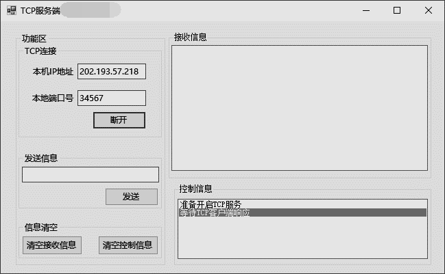
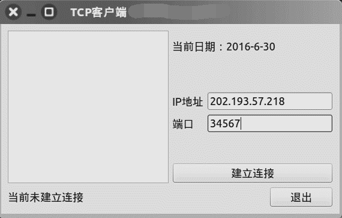
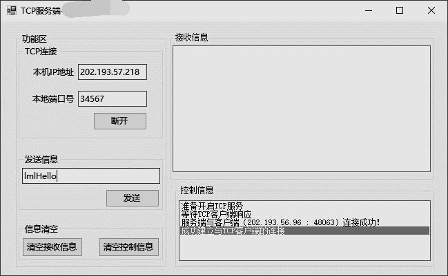
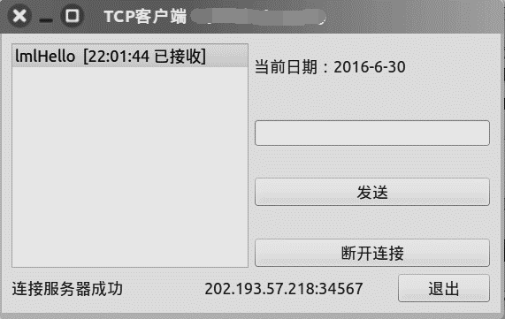
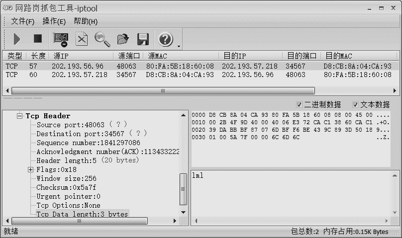

# 基于QT的跨平台 TCP 演示程序

[](https://github.com/bitkylin/CommBaseQt/releases)
[](https://raw.githubusercontent.com/bitkylin/BitkyShop/master/LICENSE)

## 项目说明

本项目使用 C/S 模式。在嵌入式平台下，成功移植 Linux 系统，使用 C++ 图形用户界面应用程序框架 Qt 开发系统的 TCP 客户端，在 PC 端，使用 C# 在 .NET 平台下开发系统的 TCP 服务器端。

- SocketServer：基于 .NET 平台的 TCP 服务端

- bitlightSocketClient：基于桌面平台的 TCP 客户端，可针对 Windows 和 Linux 平台进行编译

- bitlightSocketClientARM：基于嵌入式 Linux 平台的 TCP 客户端，可针对搭载 Qt 4.7.1 环境的嵌入式 linux 平台进行编译运行。

### 嵌入式 Linux 平台运行说明

将已编译成功的可执行文件「例如：kydemo」移入系统中拥有读写权限的任意目录。使用远程登录工具 Xshell 登录嵌入式 linux 平台，使用终端进入应用程序存放的目录，执行如下命令：
```
./kydemo –qws
```
该应用程序即可成功启动。


### 系统的基本原理

PC 端及嵌入式 Linux 平台均调用标准的 Socket 套接字通过 TCP/IP 协议进行通信。在服务器端的主线程中，首先读取来自客户端的请求，服务器端等待服务，一旦有客户端的通信请求，如果通信协议符合，则新建子线程，使用此线程与 TCP 客户端建立连接，进行通信，服务器使用 TCP 套接字与客户端通信。服务器与客户端建立 TCP 连接后，通过双方的应用程序进行通信。

## Qt 客户端技术点

Qt 中集成的 QTcpSocket 类可实现 TCP 客户端的主要功能。 QTcpSocket 继承自 QIODevice，所以它可以从 QDataStream 或 QTextStream 中读取或写入数据。

## 项目展示

打开TCP服务端软件，软件会自动获取本机IP地址，并填入相应的 TextBox 中，手动指定一个序号为 1024 ~ 65535 中未被占用的端口号，填入相应的 TextBox 中，点击监听按钮，服务器端开始监听端口，等待 TCP 客户端的连接请求：



以 Ubuntu Kylin 16.04 LTS 操作系统为例，，启动TCP客户端程序，分别指定 TCP 服务端正在进行监听的 IP 地址和端口号：



点击「建立连接」按钮，即可成功建立 TCP 客户端及服务端的连接。





使用TCP客户端发送信息「lml」的同时，使用抓包工具对此次通信产生的数据包进行抓取，抓取结果如图所示：



该软件上方显示已抓取的数据包的基本信息，右下方显示数据包的 16 进制数据信息以及此 TCP 报文所传递的字符串，左下方显示整个 MAC 帧解析出来的信息，包括 MAC 帧首部信息，IP 数据报首部信息，TCP 报文首部信息等。

## [License](https://github.com/bitkylin/CommBaseQt/blob/master/LICENSE)

> GNU General Public License v3.0
> 
> Permissions of this strong copyleft license are conditioned on making available complete source code of licensed works and modifications, which include larger works using a licensed work, under the same license. Copyright and license notices must be preserved. Contributors provide an express grant of patent rights.

## 关于我

### 1. 我的主页

名称|二级域名|原始地址
---|---|---
主页|http://bitky.cc|https://bitkylin.github.io
GitHub|http://github.bitky.cc|https://github.com/bitkylin
简书|http://js.bitky.cc|http://www.jianshu.com/u/bd2e386a6ea8
CSDN|http://csdn.bitky.cc|http://blog.csdn.net/llmmll08


### 2. 其他

- 兴趣方向: Java, Android, C#, JavaScript, Node.js, Kotlin 等

- Email: bitkylin@163.com
